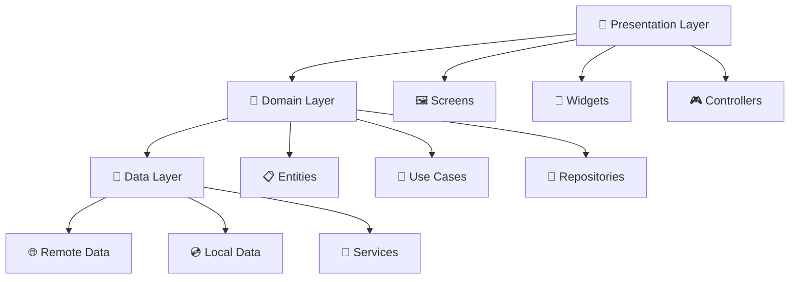

<div align="center">

# 💰 CashSify App


[](https://github.com/karthi-AI-hub/CashSify_App/stargazers)
[](https://github.com/karthi-AI-hub/CashSify_App/network/members)
[](https://github.com/karthi-AI-hub/CashSify_App/issues)
[](https://github.com/karthi-AI-hub/CashSify_App/blob/main/LICENSE)

### 🚀 A modern Flutter application for managing earnings, referrals, and withdrawals

*Built with Clean Architecture • Material 3 Design • Real-time Updates*

[📱 Download APK](#) • [📖 Documentation](documentation.md) • [🐛 Report Bug](https://github.com/karthi-AI-hub/CashSify_App/issues) • [✨ Request Feature](https://github.com/karthi-AI-hub/CashSify_App/issues)

</div>

---

## 🎯 Features at a Glance

<table>
<tr>
<td width="50%">

### 🔐 **Secure Authentication**
- Biometric login support
- Multi-factor authentication
- Social login integration
- Secure session management

### 💰 **Smart Wallet System**
- Real-time balance tracking
- Multiple withdrawal methods
- Transaction history
- Automated earnings calculation

</td>
<td width="50%">

### 🎯 **Referral Program**
- Multi-level referral system
- Real-time commission tracking
- Referral analytics dashboard
- Automated reward distribution

### 📱 **Ad Integration**
- Rewarded video ads
- Banner advertisements
- Native ad placements
- Revenue optimization

</td>
</tr>
</table>

## 📱 Screenshots & Demo

<div align="center">

### 🎬 App Preview
*Coming Soon - Screenshots and demo videos will be added here*

<table>
<tr>
<td align="center">

<br><b>🔐 Login Screen</b>
</td>
<td align="center">

<br><b>📊 Dashboard</b>
</td>
<td align="center">

<br><b>💰 Wallet</b>
</td>
<td align="center">

<br><b>🎯 Referrals</b>
</td>
</tr>
</table>

</div>

---

## 🏗️ Project Architecture

<div align="center">



</div>

### 📂 Project Structure

```text
lib/
├── 🎯 core/                      # Core functionality
│   ├── ❌ error/                # Error handling
│   ├── 🛠️ utils/                # Utilities
│   ├── 🧩 widgets/              # Reusable widgets
│   ├── 🔄 providers/            # State management
│   ├── ⚙️ services/             # Core services
│   ├── 📦 models/               # Core models
│   └── ⚙️ config/               # App configuration
├── 🏠 app/                      # App-wide configuration
│   └── 🗺️ router/               # Routing configuration
├── 🎨 theme/                    # Theme and styling
├── ✨ features/                 # Feature modules
│   ├── 🔐 auth/                 # Authentication
│   ├── 📊 dashboard/            # Main dashboard
│   ├── 👤 profile/              # User profile management
│   ├── 🔒 captcha/              # Captcha verification
│   ├── 🎯 referrals/            # Referral system
│   ├── 💰 wallet/               # Wallet and withdrawals
│   └── 📱 ads/                  # Advertisement features
└── 🚀 main.dart                 # Application entry point
```

## Feature Structure

Each feature follows Clean Architecture principles with this structure:

```text
feature/
├── data/                    # Data layer
│   ├── repositories/        # Repository implementations
│   └── datasources/        # Data sources
│       ├── local/          # Local data sources
│       └── remote/         # Remote data sources
├── domain/                  # Domain layer
│   ├── entities/           # Business objects
│   └── repositories/       # Repository interfaces
└── presentation/           # Presentation layer
    ├── screens/           # UI screens
    ├── widgets/           # Feature-specific widgets
    └── controllers/       # State management
```

## 🚀 Quick Start

<div align="center">

### ⚡ Get up and running in 3 minutes!

</div>

<table>
<tr>
<td width="33%">

### 📋 **Prerequisites**
```bash
# Check Flutter installation
flutter doctor

# Required versions
Flutter: >=3.0.0
Dart: >=3.0.0
```

</td>
<td width="33%">

### 📥 **Installation**
```bash
# Clone repository
git clone https://github.com/karthi-AI-hub/CashSify_App.git

# Navigate to project
cd CashSify_App

# Install dependencies
flutter pub get
```

</td>
<td width="33%">

### 🏃‍♂️ **Run App**
```bash
# Run on device/emulator
flutter run

# Run in release mode
flutter run --release

# Run on specific device
flutter run -d <device-id>
```

</td>
</tr>
</table>

### 🔧 Environment Setup

<details>
<summary><b>📱 Android Setup</b></summary>

```bash
# Accept Android licenses
flutter doctor --android-licenses

# Check Android setup
flutter doctor -v
```

</details>

<details>
<summary><b>🍎 iOS Setup (macOS only)</b></summary>

```bash
# Install CocoaPods
sudo gem install cocoapods

# Setup iOS dependencies
cd ios && pod install
```

</details>

<details>
<summary><b>⚙️ Environment Variables</b></summary>

Create a `.env` file in the root directory:

```env
# Supabase Configuration
SUPABASE_URL=your_supabase_url
SUPABASE_ANON_KEY=your_supabase_anon_key

# Ad Network Keys
ADMOB_APP_ID=your_admob_app_id
ADMOB_BANNER_ID=your_banner_id
ADMOB_INTERSTITIAL_ID=your_interstitial_id

# Other Configuration
API_BASE_URL=your_api_base_url
```

</details>

## 🛠️ Tech Stack

<div align="center">

<table>
<tr>
<td align="center" width="20%">

<br><b>Flutter</b>
<br><sub>UI Framework</sub>
</td>
<td align="center" width="20%">

<br><b>Riverpod</b>
<br><sub>State Management</sub>
</td>
<td align="center" width="20%">

<br><b>Supabase</b>
<br><sub>Backend</sub>
</td>
<td align="center" width="20%">

<br><b>Material 3</b>
<br><sub>Design System</sub>
</td>
<td align="center" width="20%">

<br><b>GoRouter</b>
<br><sub>Navigation</sub>
</td>
</tr>
</table>

### 📦 Key Dependencies

</div>

| Package | Version | Purpose |
|---------|---------|---------|
| 🎯 [flutter_riverpod](https://pub.dev/packages/flutter_riverpod) | `^2.4.0` | State management |
| 🗺️ [go_router](https://pub.dev/packages/go_router) | `^12.0.0` | Navigation & routing |
| 🔗 [supabase_flutter](https://pub.dev/packages/supabase_flutter) | `^1.10.0` | Backend services |
| 🎨 [google_fonts](https://pub.dev/packages/google_fonts) | `^6.1.0` | Typography |
| 📱 [google_mobile_ads](https://pub.dev/packages/google_mobile_ads) | `^4.0.0` | Ad integration |
| 🔒 [local_auth](https://pub.dev/packages/local_auth) | `^2.1.0` | Biometric authentication |
| 💾 [shared_preferences](https://pub.dev/packages/shared_preferences) | `^2.2.0` | Local storage |
| 🌐 [dio](https://pub.dev/packages/dio) | `^5.3.0` | HTTP client |

## Architecture

The app follows **Clean Architecture** principles with these key concepts:

- **Separation of concerns** - Each layer has a specific responsibility
- **Dependency injection** - Loose coupling between components
- **Repository pattern** - Abstraction of data sources
- **Feature-first organization** - Code organized by business features

### Core Components

- **[Error Handling](lib/core/error/)** - Centralized error management
- **[State Management](lib/core/providers/)** - Riverpod providers
- **[Navigation](lib/app/router/)** - GoRouter configuration
- **[Theme](lib/theme/)** - Material 3 design system

## Features

### 🔐 Authentication
Secure user authentication and authorization with Supabase.

### 📊 Dashboard
Main interface showing user statistics and quick actions.

### 👤 Profile Management
User profile settings and account management.

### 💰 Wallet & Withdrawals
Earnings tracking and withdrawal management.

### 🎯 Referral System
User referral program with tracking and rewards.

### 📱 Advertisement Integration
Watch ads to earn rewards functionality.

### 🔒 Captcha Verification
Security verification for sensitive operations.

## Error Handling

The app implements comprehensive error handling:

- **Centralized error management** in [`core/error`](lib/core/error/)
- **Custom error types** for different scenarios
- **Error boundary widgets** to catch and display errors gracefully
- **User-friendly error screens** with actionable feedback

## State Management

Built with **Riverpod** for predictable state management:

- **Global providers** in [`core/providers`](lib/core/providers/)
- **Feature-specific controllers** for local state
- **Reactive UI updates** based on state changes

## Navigation

Powered by **GoRouter** for modern navigation:

- **Declarative routing** configuration
- **Route guards** for authentication
- **Deep linking** support
- **Type-safe navigation**

## Theming

Modern **Material 3** design system:

- **Light and dark theme** support
- **Custom color schemes** and typography
- **Responsive design** for different screen sizes
- **Consistent visual language** across the app

## Development

### Code Style

- Follow [Dart style guide](https://dart.dev/guides/language/effective-dart/style)
- Use meaningful variable and function names
- Add comments for complex business logic
- Keep functions small and focused

### Testing

```bash
# Run all tests
flutter test

# Run tests with coverage
flutter test --coverage
```

### Building

```bash
# Build for Android
flutter build apk

# Build for iOS
flutter build ios

# Build for web
flutter build web
```

## 🤝 Contributing

<div align="center">

### We love contributions! Here's how you can help make CashSify even better:

</div>

<table>
<tr>
<td width="33%">

### 🍴 **Fork & Clone**
```bash
# Fork the repo on GitHub
# Then clone your fork
git clone https://github.com/YOUR_USERNAME/CashSify_App.git
```

</td>
<td width="33%">

### 🌿 **Create Branch**
```bash
# Create feature branch
git checkout -b feature/amazing-feature

# Or bug fix branch
git checkout -b fix/bug-description
```

</td>
<td width="33%">

### 🚀 **Submit PR**
```bash
# Commit your changes
git commit -m "✨ Add amazing feature"

# Push to your fork
git push origin feature/amazing-feature
```

</td>
</tr>
</table>

### 📋 Contribution Guidelines

- 🐛 **Bug Reports**: Use the [bug report template](https://github.com/karthi-AI-hub/CashSify_App/issues/new?template=bug_report.md)
- ✨ **Feature Requests**: Use the [feature request template](https://github.com/karthi-AI-hub/CashSify_App/issues/new?template=feature_request.md)
- 📝 **Code Style**: Follow [Dart style guide](https://dart.dev/guides/language/effective-dart/style)
- ✅ **Testing**: Add tests for new features
- 📖 **Documentation**: Update docs for API changes

---

## 📊 Project Stats

<div align="center">


</div>

---

## 📄 License

<div align="center">

This project is licensed under the **MIT License** - see the [LICENSE](LICENSE) file for details.

[](https://opensource.org/licenses/MIT)

</div>

---

## 💬 Support & Community

<div align="center">

### Need help? We're here for you!

<table>
<tr>
<td align="center">
<a href="https://github.com/karthi-AI-hub/CashSify_App/issues">

</a>
<br><b>🐛 Report Bugs</b>
</td>
<td align="center">
<a href="https://github.com/karthi-AI-hub/CashSify_App/discussions">

</a>
<br><b>💬 Ask Questions</b>
</td>
<td align="center">
<a href="mailto:support@cashsify.com">

</a>
<br><b>📧 Email Us</b>
</td>
</tr>
</table>

### 🌟 Show your support

If this project helped you, please consider giving it a ⭐ on GitHub!

[](https://github.com/karthi-AI-hub/CashSify_App/stargazers)

</div>

---

<div align="center">

### 🚀 **Ready to start earning? Let's build something amazing together!**

[📱 Download APK](#) • [📖 Full Documentation](documentation.md) • [🎯 Roadmap](#) • [🤝 Contributing](#-contributing)

**Made with ❤️ by the CashSify Team**

</div>