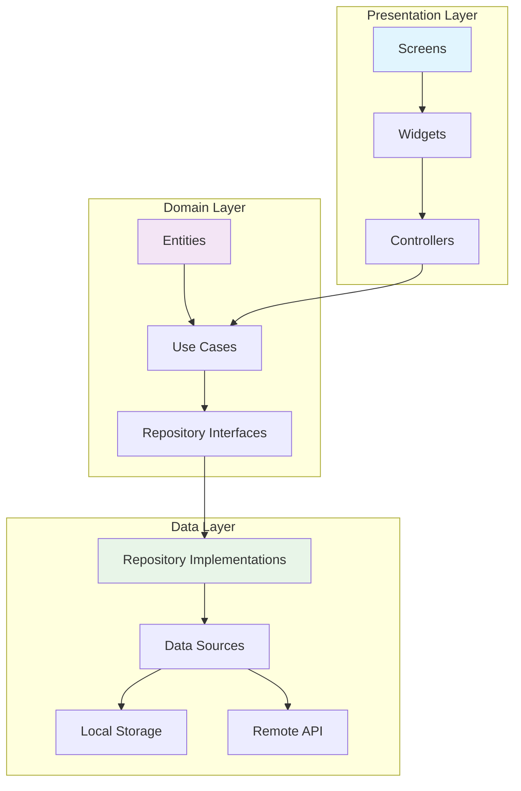
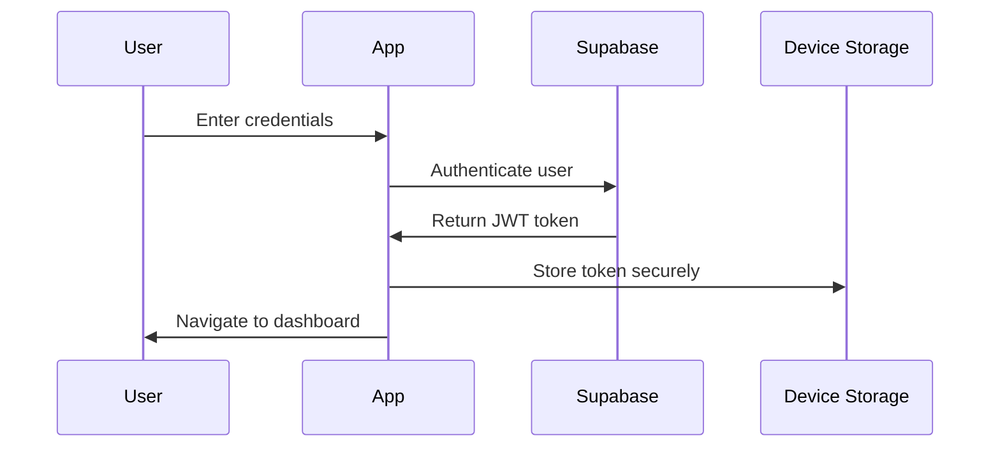
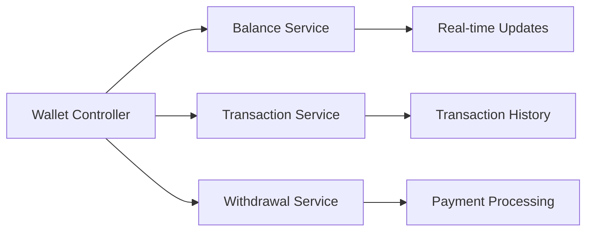
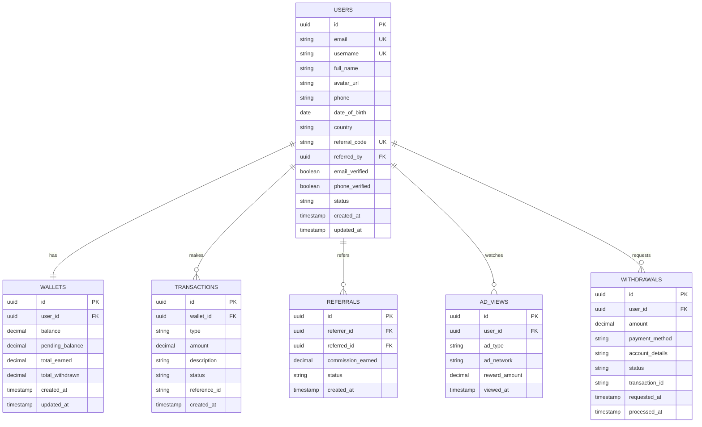

<div align="center">

# 📖 CashSify App - Complete Documentation

### Comprehensive guide for developers, contributors, and users

[](documentation.md)
[](https://github.com/karthi-AI-hub/CashSify_App)
[](https://flutter.dev)

[🏠 Back to README](README.md) • [🚀 Quick Start](#-quick-start) • [🏗️ Architecture](#-architecture) • [📱 Features](#-features) • [🔧 API Reference](#-api-reference)

</div>

---

## 📋 Table of Contents

- [🎯 Overview](#-overview)
- [🚀 Quick Start](#-quick-start)
- [🏗️ Architecture](#-architecture)
- [📱 Features](#-features)
- [🔧 Setup & Configuration](#-setup--configuration)
- [📊 Database Schema](#-database-schema)
- [🔌 API Reference](#-api-reference)
- [🎨 UI/UX Guidelines](#-uiux-guidelines)
- [🧪 Testing](#-testing)
- [🚀 Deployment](#-deployment)
- [🔒 Security](#-security)
- [📈 Performance](#-performance)
- [🐛 Troubleshooting](#-troubleshooting)
- [🤝 Contributing](#-contributing)

---

## 🎯 Overview

CashSify is a modern Flutter application designed for managing earnings, referrals, and withdrawals. Built with Clean Architecture principles, it provides a scalable, maintainable, and testable codebase.

### 🌟 Key Highlights

- **Clean Architecture**: Separation of concerns with clear layer boundaries
- **State Management**: Riverpod for predictable state management
- **Real-time Updates**: Live data synchronization with Supabase
- **Material 3 Design**: Modern, accessible UI components
- **Multi-platform**: iOS, Android, and Web support
- **Offline Support**: Local caching and sync capabilities

### 🎯 Target Audience

- **End Users**: Individuals looking to earn money through various activities
- **Developers**: Contributors and maintainers of the application
- **Administrators**: Backend managers and system administrators

---

## 🚀 Quick Start

### Prerequisites

<table>
<tr>
<td width="50%">

**Development Environment**
- Flutter SDK ≥ 3.0.0
- Dart SDK ≥ 3.0.0
- Android Studio / VS Code
- Git

</td>
<td width="50%">

**Platform Requirements**
- **Android**: API level 21+ (Android 5.0)
- **iOS**: iOS 11.0+
- **Web**: Modern browsers (Chrome, Firefox, Safari)

</td>
</tr>
</table>

### Installation Steps

```bash
# 1. Clone the repository
git clone https://github.com/karthi-AI-hub/CashSify_App.git
cd CashSify_App

# 2. Install dependencies
flutter pub get

# 3. Generate code (if needed)
flutter packages pub run build_runner build

# 4. Run the app
flutter run
```

### Environment Configuration

Create a `.env` file in the root directory:

```env
# Supabase Configuration
SUPABASE_URL=https://your-project.supabase.co
SUPABASE_ANON_KEY=your-anon-key
SUPABASE_SERVICE_ROLE_KEY=your-service-role-key

# AdMob Configuration
ADMOB_APP_ID_ANDROID=ca-app-pub-xxxxxxxxxxxxx~xxxxxxxxxx
ADMOB_APP_ID_IOS=ca-app-pub-xxxxxxxxxxxxx~xxxxxxxxxx
ADMOB_BANNER_ID=ca-app-pub-xxxxxxxxxxxxx/xxxxxxxxxx
ADMOB_INTERSTITIAL_ID=ca-app-pub-xxxxxxxxxxxxx/xxxxxxxxxx
ADMOB_REWARDED_ID=ca-app-pub-xxxxxxxxxxxxx/xxxxxxxxxx

# API Configuration
API_BASE_URL=https://api.cashsify.com
API_VERSION=v1
API_TIMEOUT=30000

# App Configuration
APP_NAME=CashSify
APP_VERSION=1.0.0
DEBUG_MODE=true
```

---

## 🏗️ Architecture

### Clean Architecture Overview



### Layer Responsibilities

<table>
<tr>
<td width="33%">

#### 🖼️ Presentation Layer
- **Screens**: UI pages and navigation
- **Widgets**: Reusable UI components
- **Controllers**: State management and business logic
- **Providers**: Riverpod state providers

</td>
<td width="33%">

#### 🧠 Domain Layer
- **Entities**: Core business objects
- **Use Cases**: Business logic operations
- **Repositories**: Data access interfaces
- **Value Objects**: Domain-specific types

</td>
<td width="33%">

#### 💾 Data Layer
- **Repositories**: Data access implementations
- **Data Sources**: Remote and local data access
- **Models**: Data transfer objects
- **Services**: External service integrations

</td>
</tr>
</table>

### Project Structure

```text
lib/
├── 🎯 core/                          # Core functionality
│   ├── ❌ error/                     # Error handling
│   │   ├── app_error.dart           # Custom error types
│   │   ├── error_handler.dart       # Global error handler
│   │   └── exceptions.dart          # Exception definitions
│   ├── 🛠️ utils/                     # Utility functions
│   │   ├── constants.dart           # App constants
│   │   ├── extensions.dart          # Dart extensions
│   │   ├── helpers.dart             # Helper functions
│   │   └── validators.dart          # Input validators
│   ├── 🧩 widgets/                   # Reusable widgets
│   │   ├── custom_button.dart       # Custom button widget
│   │   ├── custom_text_field.dart   # Custom input field
│   │   ├── loading_overlay.dart     # Loading indicator
│   │   └── error_screen.dart        # Error display widget
│   ├── 🔄 providers/                 # Global providers
│   │   ├── auth_provider.dart       # Authentication state
│   │   ├── theme_provider.dart      # Theme management
│   │   └── connectivity_provider.dart # Network status
│   ├── ⚙️ services/                  # Core services
│   │   ├── supabase_service.dart    # Supabase integration
│   │   ├── storage_service.dart     # Local storage
│   │   ├── notification_service.dart # Push notifications
│   │   └── analytics_service.dart   # Analytics tracking
│   ├── 📦 models/                    # Core models
│   │   ├── user_model.dart          # User data model
│   │   ├── response_model.dart      # API response model
│   │   └── pagination_model.dart    # Pagination model
│   └── ⚙️ config/                    # App configuration
│       ├── app_config.dart          # App settings
│       ├── environment.dart         # Environment variables
│       └── database_config.dart     # Database configuration
├── 🏠 app/                           # App-wide configuration
│   ├── 🗺️ router/                    # Navigation
│   │   ├── app_router.dart          # Route definitions
│   │   ├── route_guards.dart        # Authentication guards
│   │   └── route_transitions.dart   # Custom transitions
│   └── 🎨 theme/                     # App theming
│       ├── app_theme.dart           # Theme configuration
│       ├── color_scheme.dart        # Color definitions
│       └── text_theme.dart          # Typography
├── ✨ features/                      # Feature modules
│   ├── 🔐 auth/                      # Authentication
│   │   ├── data/
│   │   │   ├── datasources/
│   │   │   │   ├── auth_local_datasource.dart
│   │   │   │   └── auth_remote_datasource.dart
│   │   │   ├── models/
│   │   │   │   ├── login_model.dart
│   │   │   │   └── user_model.dart
│   │   │   └── repositories/
│   │   │       └── auth_repository_impl.dart
│   │   ├── domain/
│   │   │   ├── entities/
│   │   │   │   └── user_entity.dart
│   │   │   ├── repositories/
│   │   │   │   └── auth_repository.dart
│   │   │   └── usecases/
│   │   │       ├── login_usecase.dart
│   │   │       ├── logout_usecase.dart
│   │   │       └── register_usecase.dart
│   │   └── presentation/
│   │       ├── controllers/
│   │       │   └── auth_controller.dart
│   │       ├── screens/
│   │       │   ├── login_screen.dart
│   │       │   ├── register_screen.dart
│   │       │   └── forgot_password_screen.dart
│   │       └── widgets/
│   │           ├── login_form.dart
│   │           └── social_login_buttons.dart
│   ├── 📊 dashboard/                 # Main dashboard
│   ├── 👤 profile/                   # User profile
│   ├── 💰 wallet/                    # Wallet & transactions
│   ├── 🎯 referrals/                 # Referral system
│   ├── 📱 ads/                       # Advertisement
│   └── 🔒 captcha/                   # Security verification
└── 🚀 main.dart                      # Application entry point
```

---

## 📱 Features

### 🔐 Authentication System

<details>
<summary><b>📋 Feature Overview</b></summary>

The authentication system provides secure user registration, login, and session management.

**Capabilities:**
- Email/password authentication
- Social login (Google, Apple, Facebook)
- Biometric authentication
- Two-factor authentication (2FA)
- Password recovery
- Account verification

**Security Features:**
- JWT token management
- Secure session handling
- Automatic token refresh
- Device fingerprinting
- Rate limiting

</details>

<details>
<summary><b>🔧 Implementation Details</b></summary>

**Authentication Flow:**



**Key Components:**
- `AuthController`: Manages authentication state
- `AuthRepository`: Handles authentication operations
- `AuthLocalDataSource`: Local token storage
- `AuthRemoteDataSource`: API communication

**Usage Example:**

```dart
// Login user
final result = await ref.read(authControllerProvider.notifier).login(
  email: 'user@example.com',
  password: 'password123',
);

// Check authentication status
final isAuthenticated = ref.watch(authControllerProvider).isAuthenticated;

// Logout user
await ref.read(authControllerProvider.notifier).logout();
```

</details>

### 💰 Wallet System

<details>
<summary><b>📋 Feature Overview</b></summary>

Comprehensive wallet management for tracking earnings, managing withdrawals, and viewing transaction history.

**Capabilities:**
- Real-time balance tracking
- Multiple earning sources
- Withdrawal requests
- Transaction history
- Payment method management
- Currency conversion

**Supported Payment Methods:**
- Bank transfer
- PayPal
- UPI (India)
- Cryptocurrency
- Gift cards

</details>

<details>
<summary><b>🔧 Implementation Details</b></summary>

**Wallet Architecture:**



**Database Schema:**

```sql
-- Wallet table
CREATE TABLE wallets (
    id UUID PRIMARY KEY DEFAULT gen_random_uuid(),
    user_id UUID REFERENCES users(id),
    balance DECIMAL(10,2) DEFAULT 0.00,
    pending_balance DECIMAL(10,2) DEFAULT 0.00,
    total_earned DECIMAL(10,2) DEFAULT 0.00,
    total_withdrawn DECIMAL(10,2) DEFAULT 0.00,
    created_at TIMESTAMP DEFAULT NOW(),
    updated_at TIMESTAMP DEFAULT NOW()
);

-- Transactions table
CREATE TABLE transactions (
    id UUID PRIMARY KEY DEFAULT gen_random_uuid(),
    wallet_id UUID REFERENCES wallets(id),
    type VARCHAR(20) NOT NULL, -- 'earning', 'withdrawal', 'bonus'
    amount DECIMAL(10,2) NOT NULL,
    description TEXT,
    status VARCHAR(20) DEFAULT 'completed',
    reference_id VARCHAR(100),
    created_at TIMESTAMP DEFAULT NOW()
);
```

**Usage Example:**

```dart
// Get wallet balance
final wallet = await ref.read(walletControllerProvider.notifier).getWallet();

// Add earnings
await ref.read(walletControllerProvider.notifier).addEarning(
  amount: 10.50,
  source: 'ad_watch',
  description: 'Watched rewarded video ad',
);

// Request withdrawal
await ref.read(walletControllerProvider.notifier).requestWithdrawal(
  amount: 50.00,
  paymentMethod: PaymentMethod.paypal,
  accountDetails: 'user@paypal.com',
);
```

</details>

### 🎯 Referral System

<details>
<summary><b>📋 Feature Overview</b></summary>

Multi-level referral system with commission tracking and reward distribution.

**Capabilities:**
- Unique referral codes
- Multi-level commissions
- Referral analytics
- Bonus campaigns
- Social sharing
- Leaderboards

**Commission Structure:**
- Level 1: 10% of referral earnings
- Level 2: 5% of sub-referral earnings
- Level 3: 2% of sub-sub-referral earnings

</details>

### 📱 Advertisement Integration

<details>
<summary><b>📋 Feature Overview</b></summary>

Comprehensive ad integration for monetization through various ad formats.

**Ad Types:**
- Rewarded video ads
- Banner advertisements
- Interstitial ads
- Native ads
- Offerwall integration

**Ad Networks:**
- Google AdMob
- Facebook Audience Network
- Unity Ads
- IronSource
- Custom ad networks

</details>

---

## 🔧 Setup & Configuration

### Development Environment

<details>
<summary><b>🛠️ Flutter Setup</b></summary>

```bash
# Install Flutter
git clone https://github.com/flutter/flutter.git -b stable
export PATH="$PATH:`pwd`/flutter/bin"

# Verify installation
flutter doctor

# Enable web support
flutter config --enable-web

# Enable desktop support (optional)
flutter config --enable-macos-desktop
flutter config --enable-windows-desktop
flutter config --enable-linux-desktop
```

</details>

<details>
<summary><b>🔧 IDE Configuration</b></summary>

**VS Code Extensions:**
- Flutter
- Dart
- Flutter Widget Snippets
- Awesome Flutter Snippets
- Flutter Tree
- Error Lens

**Android Studio Plugins:**
- Flutter
- Dart
- Flutter Inspector
- Flutter Snippets

**Recommended Settings:**

```json
// .vscode/settings.json
{
  "dart.flutterSdkPath": "/path/to/flutter",
  "dart.lineLength": 80,
  "dart.insertArgumentPlaceholders": false,
  "dart.previewFlutterUiGuides": true,
  "dart.previewFlutterUiGuidesCustomTracking": true,
  "editor.rulers": [80],
  "editor.formatOnSave": true
}
```

</details>

### Backend Configuration

<details>
<summary><b>🗄️ Supabase Setup</b></summary>

1. **Create Supabase Project:**
   - Go to [supabase.com](https://supabase.com)
   - Create new project
   - Note down URL and anon key

2. **Database Schema:**

```sql
-- Enable RLS
ALTER TABLE users ENABLE ROW LEVEL SECURITY;
ALTER TABLE wallets ENABLE ROW LEVEL SECURITY;
ALTER TABLE transactions ENABLE ROW LEVEL SECURITY;
ALTER TABLE referrals ENABLE ROW LEVEL SECURITY;

-- Create tables
CREATE TABLE users (
    id UUID PRIMARY KEY DEFAULT gen_random_uuid(),
    email VARCHAR(255) UNIQUE NOT NULL,
    username VARCHAR(50) UNIQUE,
    full_name VARCHAR(100),
    avatar_url TEXT,
    phone VARCHAR(20),
    date_of_birth DATE,
    country VARCHAR(2),
    referral_code VARCHAR(10) UNIQUE,
    referred_by UUID REFERENCES users(id),
    email_verified BOOLEAN DEFAULT FALSE,
    phone_verified BOOLEAN DEFAULT FALSE,
    status VARCHAR(20) DEFAULT 'active',
    created_at TIMESTAMP DEFAULT NOW(),
    updated_at TIMESTAMP DEFAULT NOW()
);

-- Create RLS policies
CREATE POLICY "Users can view own profile" ON users
    FOR SELECT USING (auth.uid() = id);

CREATE POLICY "Users can update own profile" ON users
    FOR UPDATE USING (auth.uid() = id);
```

3. **Authentication Settings:**
   - Enable email authentication
   - Configure social providers
   - Set up email templates
   - Configure redirect URLs

</details>

### Third-party Integrations

<details>
<summary><b>📱 AdMob Setup</b></summary>

1. **Create AdMob Account:**
   - Go to [admob.google.com](https://admob.google.com)
   - Create new app
   - Generate ad unit IDs

2. **Android Configuration:**

```xml
<!-- android/app/src/main/AndroidManifest.xml -->
<meta-data
    android:name="com.google.android.gms.ads.APPLICATION_ID"
    android:value="ca-app-pub-xxxxxxxxxxxxxxxx~yyyyyyyyyy"/>
```

3. **iOS Configuration:**

```xml
<!-- ios/Runner/Info.plist -->
<key>GADApplicationIdentifier</key>
<string>ca-app-pub-xxxxxxxxxxxxxxxx~yyyyyyyyyy</string>
```

</details>

---

## 📊 Database Schema

### Entity Relationship Diagram



### Table Definitions

<details>
<summary><b>👥 Users Table</b></summary>

```sql
CREATE TABLE users (
    id UUID PRIMARY KEY DEFAULT gen_random_uuid(),
    email VARCHAR(255) UNIQUE NOT NULL,
    username VARCHAR(50) UNIQUE,
    full_name VARCHAR(100),
    avatar_url TEXT,
    phone VARCHAR(20),
    date_of_birth DATE,
    country VARCHAR(2),
    referral_code VARCHAR(10) UNIQUE,
    referred_by UUID REFERENCES users(id),
    email_verified BOOLEAN DEFAULT FALSE,
    phone_verified BOOLEAN DEFAULT FALSE,
    status VARCHAR(20) DEFAULT 'active' CHECK (status IN ('active', 'suspended', 'banned')),
    created_at TIMESTAMP DEFAULT NOW(),
    updated_at TIMESTAMP DEFAULT NOW()
);

-- Indexes
CREATE INDEX idx_users_email ON users(email);
CREATE INDEX idx_users_username ON users(username);
CREATE INDEX idx_users_referral_code ON users(referral_code);
CREATE INDEX idx_users_referred_by ON users(referred_by);

-- Triggers
CREATE OR REPLACE FUNCTION update_updated_at_column()
RETURNS TRIGGER AS $$
BEGIN
    NEW.updated_at = NOW();
    RETURN NEW;
END;
$$ language 'plpgsql';

CREATE TRIGGER update_users_updated_at BEFORE UPDATE ON users
    FOR EACH ROW EXECUTE FUNCTION update_updated_at_column();
```

</details>

<details>
<summary><b>💰 Wallets Table</b></summary>

```sql
CREATE TABLE wallets (
    id UUID PRIMARY KEY DEFAULT gen_random_uuid(),
    user_id UUID UNIQUE REFERENCES users(id) ON DELETE CASCADE,
    balance DECIMAL(10,2) DEFAULT 0.00 CHECK (balance >= 0),
    pending_balance DECIMAL(10,2) DEFAULT 0.00 CHECK (pending_balance >= 0),
    total_earned DECIMAL(10,2) DEFAULT 0.00 CHECK (total_earned >= 0),
    total_withdrawn DECIMAL(10,2) DEFAULT 0.00 CHECK (total_withdrawn >= 0),
    created_at TIMESTAMP DEFAULT NOW(),
    updated_at TIMESTAMP DEFAULT NOW()
);

-- Indexes
CREATE INDEX idx_wallets_user_id ON wallets(user_id);

-- Triggers
CREATE TRIGGER update_wallets_updated_at BEFORE UPDATE ON wallets
    FOR EACH ROW EXECUTE FUNCTION update_updated_at_column();
```

</details>

---

## 🔌 API Reference

### Authentication Endpoints

<details>
<summary><b>🔐 POST /auth/register</b></summary>

Register a new user account.

**Request Body:**
```json
{
  "email": "user@example.com",
  "password": "password123",
  "username": "johndoe",
  "full_name": "John Doe",
  "referral_code": "ABC123" // optional
}
```

**Response:**
```json
{
  "success": true,
  "data": {
    "user": {
      "id": "uuid",
      "email": "user@example.com",
      "username": "johndoe",
      "full_name": "John Doe"
    },
    "session": {
      "access_token": "jwt_token",
      "refresh_token": "refresh_token",
      "expires_at": "2024-01-01T00:00:00Z"
    }
  }
}
```

**Error Responses:**
- `400`: Invalid input data
- `409`: Email or username already exists
- `422`: Validation errors

</details>

<details>
<summary><b>🔑 POST /auth/login</b></summary>

Authenticate user and return session tokens.

**Request Body:**
```json
{
  "email": "user@example.com",
  "password": "password123"
}
```

**Response:**
```json
{
  "success": true,
  "data": {
    "user": {
      "id": "uuid",
      "email": "user@example.com",
      "username": "johndoe",
      "full_name": "John Doe"
    },
    "session": {
      "access_token": "jwt_token",
      "refresh_token": "refresh_token",
      "expires_at": "2024-01-01T00:00:00Z"
    }
  }
}
```

</details>

### Wallet Endpoints

<details>
<summary><b>💰 GET /wallet</b></summary>

Get user's wallet information.

**Headers:**
```
Authorization: Bearer <access_token>
```

**Response:**
```json
{
  "success": true,
  "data": {
    "id": "uuid",
    "balance": 125.50,
    "pending_balance": 25.00,
    "total_earned": 500.75,
    "total_withdrawn": 350.25,
    "created_at": "2024-01-01T00:00:00Z",
    "updated_at": "2024-01-01T00:00:00Z"
  }
}
```

</details>

<details>
<summary><b>📊 GET /wallet/transactions</b></summary>

Get transaction history with pagination.

**Query Parameters:**
- `page`: Page number (default: 1)
- `limit`: Items per page (default: 20, max: 100)
- `type`: Transaction type filter (earning, withdrawal, bonus)
- `status`: Status filter (completed, pending, failed)

**Response:**
```json
{
  "success": true,
  "data": {
    "transactions": [
      {
        "id": "uuid",
        "type": "earning",
        "amount": 10.50,
        "description": "Watched rewarded video ad",
        "status": "completed",
        "created_at": "2024-01-01T00:00:00Z"
      }
    ],
    "pagination": {
      "current_page": 1,
      "total_pages": 5,
      "total_items": 100,
      "items_per_page": 20
    }
  }
}
```

</details>

### Referral Endpoints

<details>
<summary><b>🎯 GET /referrals</b></summary>

Get user's referral information and statistics.

**Response:**
```json
{
  "success": true,
  "data": {
    "referral_code": "ABC123",
    "total_referrals": 15,
    "active_referrals": 12,
    "total_commission": 125.50,
    "this_month_commission": 45.25,
    "referrals": [
      {
        "id": "uuid",
        "username": "referred_user",
        "joined_at": "2024-01-01T00:00:00Z",
        "status": "active",
        "commission_earned": 25.50
      }
    ]
  }
}
```

</details>

---

## 🎨 UI/UX Guidelines

### Design System

<details>
<summary><b>🎨 Color Palette</b></summary>

**Primary Colors:**
```dart
class AppColors {
  // Primary
  static const Color primary = Color(0xFF6366F1);
  static const Color primaryVariant = Color(0xFF4F46E5);
  
  // Secondary
  static const Color secondary = Color(0xFF10B981);
  static const Color secondaryVariant = Color(0xFF059669);
  
  // Surface
  static const Color surface = Color(0xFFFFFFFF);
  static const Color surfaceVariant = Color(0xFFF8FAFC);
  
  // Background
  static const Color background = Color(0xFFFAFAFA);
  static const Color backgroundDark = Color(0xFF0F172A);
  
  // Error
  static const Color error = Color(0xFFEF4444);
  static const Color errorVariant = Color(0xFFDC2626);
  
  // Success
  static const Color success = Color(0xFF22C55E);
  static const Color warning = Color(0xFFF59E0B);
  static const Color info = Color(0xFF3B82F6);
}
```

**Usage Guidelines:**
- Use primary colors for main actions and branding
- Secondary colors for supporting elements
- Maintain 4.5:1 contrast ratio for accessibility
- Use semantic colors (success, warning, error) consistently

</details>

<details>
<summary><b>📝 Typography</b></summary>

```dart
class AppTextStyles {
  static const TextStyle h1 = TextStyle(
    fontSize: 32,
    fontWeight: FontWeight.bold,
    height: 1.2,
  );
  
  static const TextStyle h2 = TextStyle(
    fontSize: 24,
    fontWeight: FontWeight.bold,
    height: 1.3,
  );
  
  static const TextStyle h3 = TextStyle(
    fontSize: 20,
    fontWeight: FontWeight.w600,
    height: 1.4,
  );
  
  static const TextStyle body1 = TextStyle(
    fontSize: 16,
    fontWeight: FontWeight.normal,
    height: 1.5,
  );
  
  static const TextStyle body2 = TextStyle(
    fontSize: 14,
    fontWeight: FontWeight.normal,
    height: 1.4,
  );
  
  static const TextStyle caption = TextStyle(
    fontSize: 12,
    fontWeight: FontWeight.normal,
    height: 1.3,
  );
}
```

</details>

<details>
<summary><b>📏 Spacing & Layout</b></summary>

```dart
class AppSpacing {
  static const double xs = 4.0;
  static const double sm = 8.0;
  static const double md = 16.0;
  static const double lg = 24.0;
  static const double xl = 32.0;
  static const double xxl = 48.0;
}

class AppBorderRadius {
  static const double sm = 4.0;
  static const double md = 8.0;
  static const double lg = 12.0;
  static const double xl = 16.0;
  static const double circular = 999.0;
}
```

**Layout Guidelines:**
- Use consistent spacing values
- Follow 8px grid system
- Maintain proper touch targets (44px minimum)
- Use appropriate border radius for components

</details>

### Component Library

<details>
<summary><b>🔘 Custom Button</b></summary>

```dart
class CustomButton extends StatelessWidget {
  final String text;
  final VoidCallback? onPressed;
  final ButtonType type;
  final ButtonSize size;
  final bool isLoading;
  final Widget? icon;

  const CustomButton({
    Key? key,
    required this.text,
    this.onPressed,
    this.type = ButtonType.primary,
    this.size = ButtonSize.medium,
    this.isLoading = false,
    this.icon,
  }) : super(key: key);

  @override
  Widget build(BuildContext context) {
    return ElevatedButton(
      onPressed: isLoading ? null : onPressed,
      style: _getButtonStyle(),
      child: isLoading
          ? const SizedBox(
              width: 20,
              height: 20,
              child: CircularProgressIndicator(strokeWidth: 2),
            )
          : Row(
              mainAxisSize: MainAxisSize.min,
              children: [
                if (icon != null) ...[
                  icon!,
                  const SizedBox(width: 8),
                ],
                Text(text),
              ],
            ),
    );
  }

  ButtonStyle _getButtonStyle() {
    // Implementation details...
  }
}

enum ButtonType { primary, secondary, outline, text }
enum ButtonSize { small, medium, large }
```

</details>

---

## 🧪 Testing

### Testing Strategy

<details>
<summary><b>🧪 Test Pyramid</b></summary>

```mermaid
pyramid
    title Test Pyramid
    
    "E2E Tests" : 10
    "Integration Tests" : 20
    "Widget Tests" : 30
    "Unit Tests" : 40
```

**Test Distribution:**
- **Unit Tests (70%)**: Business logic, utilities, models
- **Widget Tests (20%)**: UI components, user interactions
- **Integration Tests (9%)**: Feature workflows, API integration
- **E2E Tests (1%)**: Critical user journeys

</details>

<details>
<summary><b>🔧 Test Setup</b></summary>

**Dependencies:**
```yaml
dev_dependencies:
  flutter_test:
    sdk: flutter
  mockito: ^5.4.0
  build_runner: ^2.4.0
  integration_test:
    sdk: flutter
  patrol: ^2.0.0
```

**Test Configuration:**
```dart
// test/test_helpers.dart
class TestHelpers {
  static Widget createTestableWidget(Widget child) {
    return MaterialApp(
      home: child,
    );
  }
  
  static ProviderContainer createTestContainer({
    List<Override> overrides = const [],
  }) {
    return ProviderContainer(
      overrides: overrides,
    );
  }
}
```

</details>

<details>
<summary><b>📝 Unit Tests</b></summary>

**Example: Wallet Service Test**

```dart
// test/core/services/wallet_service_test.dart
import 'package:flutter_test/flutter_test.dart';
import 'package:mockito/mockito.dart';
import 'package:mockito/annotations.dart';

@GenerateMocks([SupabaseClient])
import 'wallet_service_test.mocks.dart';

void main() {
  group('WalletService', () {
    late WalletService walletService;
    late MockSupabaseClient mockSupabase;

    setUp(() {
      mockSupabase = MockSupabaseClient();
      walletService = WalletService(mockSupabase);
    });

    group('getWallet', () {
      test('should return wallet when successful', () async {
        // Arrange
        final walletData = {
          'id': 'test-id',
          'balance': 100.0,
          'total_earned': 500.0,
        };
        
        when(mockSupabase.from('wallets').select().eq('user_id', any))
            .thenAnswer((_) async => [walletData]);

        // Act
        final result = await walletService.getWallet('user-id');

        // Assert
        expect(result.isRight(), true);
        result.fold(
          (failure) => fail('Expected success'),
          (wallet) {
            expect(wallet.id, 'test-id');
            expect(wallet.balance, 100.0);
            expect(wallet.totalEarned, 500.0);
          },
        );
      });

      test('should return failure when error occurs', () async {
        // Arrange
        when(mockSupabase.from('wallets').select().eq('user_id', any))
            .thenThrow(Exception('Database error'));

        // Act
        final result = await walletService.getWallet('user-id');

        // Assert
        expect(result.isLeft(), true);
        result.fold(
          (failure) => expect(failure, isA<ServerFailure>()),
          (wallet) => fail('Expected failure'),
        );
      });
    });
  });
}
```

</details>

<details>
<summary><b>🎨 Widget Tests</b></summary>

**Example: Login Screen Test**

```dart
// test/features/auth/presentation/screens/login_screen_test.dart
import 'package:flutter/material.dart';
import 'package:flutter_test/flutter_test.dart';
import 'package:flutter_riverpod/flutter_riverpod.dart';

void main() {
  group('LoginScreen', () {
    testWidgets('should display login form', (tester) async {
      // Arrange
      await tester.pumpWidget(
        ProviderScope(
          child: MaterialApp(
            home: LoginScreen(),
          ),
        ),
      );

      // Assert
      expect(find.text('Welcome Back'), findsOneWidget);
      expect(find.byType(TextFormField), findsNWidgets(2));
      expect(find.text('Login'), findsOneWidget);
      expect(find.text('Forgot Password?'), findsOneWidget);
    });

    testWidgets('should show validation errors for empty fields', (tester) async {
      // Arrange
      await tester.pumpWidget(
        ProviderScope(
          child: MaterialApp(
            home: LoginScreen(),
          ),
        ),
      );

      // Act
      await tester.tap(find.text('Login'));
      await tester.pump();

      // Assert
      expect(find.text('Please enter your email'), findsOneWidget);
      expect(find.text('Please enter your password'), findsOneWidget);
    });

    testWidgets('should call login when form is valid', (tester) async {
      // Arrange
      bool loginCalled = false;
      
      await tester.pumpWidget(
        ProviderScope(
          overrides: [
            authControllerProvider.overrideWith((ref) {
              return MockAuthController()..onLogin = () => loginCalled = true;
            }),
          ],
          child: MaterialApp(
            home: LoginScreen(),
          ),
        ),
      );

      // Act
      await tester.enterText(
        find.byType(TextFormField).first,
        'test@example.com',
      );
      await tester.enterText(
        find.byType(TextFormField).last,
        'password123',
      );
      await tester.tap(find.text('Login'));
      await tester.pump();

      // Assert
      expect(loginCalled, true);
    });
  });
}
```

</details>

<details>
<summary><b>🔗 Integration Tests</b></summary>

**Example: Authentication Flow Test**

```dart
// integration_test/auth_flow_test.dart
import 'package:flutter_test/flutter_test.dart';
import 'package:integration_test/integration_test.dart';
import 'package:cashsify_app/main.dart' as app;

void main() {
  IntegrationTestWidgetsFlutterBinding.ensureInitialized();

  group('Authentication Flow', () {
    testWidgets('complete registration and login flow', (tester) async {
      // Start app
      app.main();
      await tester.pumpAndSettle();

      // Navigate to registration
      await tester.tap(find.text('Create Account'));
      await tester.pumpAndSettle();

      // Fill registration form
      await tester.enterText(
        find.byKey(const Key('email_field')),
        'test@example.com',
      );
      await tester.enterText(
        find.byKey(const Key('username_field')),
        'testuser',
      );
      await tester.enterText(
        find.byKey(const Key('password_field')),
        'password123',
      );
      await tester.enterText(
        find.byKey(const Key('confirm_password_field')),
        'password123',
      );

      // Submit registration
      await tester.tap(find.text('Register'));
      await tester.pumpAndSettle();

      // Verify navigation to dashboard
      expect(find.text('Dashboard'), findsOneWidget);
      expect(find.text('Welcome, testuser!'), findsOneWidget);

      // Test logout
      await tester.tap(find.byIcon(Icons.menu));
      await tester.pumpAndSettle();
      await tester.tap(find.text('Logout'));
      await tester.pumpAndSettle();

      // Verify navigation back to login
      expect(find.text('Welcome Back'), findsOneWidget);

      // Test login with created account
      await tester.enterText(
        find.byKey(const Key('email_field')),
        'test@example.com',
      );
      await tester.enterText(
        find.byKey(const Key('password_field')),
        'password123',
      );
      await tester.tap(find.text('Login'));
      await tester.pumpAndSettle();

      // Verify successful login
      expect(find.text('Dashboard'), findsOneWidget);
    });
  });
}
```

</details>

### Running Tests

```bash
# Run all tests
flutter test

# Run tests with coverage
flutter test --coverage

# Run specific test file
flutter test test/features/auth/auth_test.dart

# Run integration tests
flutter test integration_test/

# Run tests in watch mode
flutter test --watch

# Generate coverage report
genhtml coverage/lcov.info -o coverage/html
```

---

## 🚀 Deployment

### Build Configuration

<details>
<summary><b>📱 Android Build</b></summary>

**Build Configuration:**

```gradle
// android/app/build.gradle
android {
    compileSdkVersion 34
    
    defaultConfig {
        applicationId "com.cashsify.app"
        minSdkVersion 21
        targetSdkVersion 34
        versionCode flutterVersionCode.toInteger()
        versionName flutterVersionName
        multiDexEnabled true
    }
    
    signingConfigs {
        release {
            keyAlias keystoreProperties['keyAlias']
            keyPassword keystoreProperties['keyPassword']
            storeFile keystoreProperties['storeFile'] ? file(keystoreProperties['storeFile']) : null
            storePassword keystoreProperties['storePassword']
        }
    }
    
    buildTypes {
        release {
            signingConfig signingConfigs.release
            minifyEnabled true
            shrinkResources true
            proguardFiles getDefaultProguardFile('proguard-android-optimize.txt'), 'proguard-rules.pro'
        }
    }
}
```

**Build Commands:**

```bash
# Debug build
flutter build apk --debug

# Release build
flutter build apk --release

# App bundle for Play Store
flutter build appbundle --release

# Split APKs by ABI
flutter build apk --split-per-abi --release
```

</details>

<details>
<summary><b>🍎 iOS Build</b></summary>

**Build Configuration:**

```xml
<!-- ios/Runner/Info.plist -->
<key>CFBundleDisplayName</key>
<string>CashSify</string>
<key>CFBundleIdentifier</key>
<string>com.cashsify.app</string>
<key>CFBundleVersion</key>
<string>$(FLUTTER_BUILD_NUMBER)</string>
<key>CFBundleShortVersionString</key>
<string>$(FLUTTER_BUILD_NAME)</string>
```

**Build Commands:**

```bash
# Debug build
flutter build ios --debug

# Release build
flutter build ios --release

# Build for simulator
flutter build ios --simulator

# Archive for App Store
flutter build ipa --release
```

</details>

<details>
<summary><b>🌐 Web Build</b></summary>

**Build Configuration:**

```html
<!-- web/index.html -->
<!DOCTYPE html>
<html>
<head>
  <meta charset="UTF-8">
  <meta content="IE=Edge" http-equiv="X-UA-Compatible">
  <meta name="description" content="CashSify - Earn money through various activities">
  <meta name="apple-mobile-web-app-capable" content="yes">
  <meta name="apple-mobile-web-app-status-bar-style" content="black">
  <meta name="apple-mobile-web-app-title" content="CashSify">
  <link rel="apple-touch-icon" href="icons/Icon-192.png">
  <link rel="icon" type="image/png" href="favicon.png"/>
  <title>CashSify</title>
</head>
<body>
  <script src="main.dart.js" type="application/javascript"></script>
</body>
</html>
```

**Build Commands:**

```bash
# Debug build
flutter build web --debug

# Release build
flutter build web --release

# Build with specific renderer
flutter build web --web-renderer canvaskit

# Build with PWA support
flutter build web --pwa-strategy offline-first
```

</details>

### CI/CD Pipeline

<details>
<summary><b>🔄 GitHub Actions</b></summary>

```yaml
# .github/workflows/ci.yml
name: CI/CD Pipeline

on:
  push:
    branches: [ main, develop ]
  pull_request:
    branches: [ main ]

jobs:
  test:
    runs-on: ubuntu-latest
    steps:
    - uses: actions/checkout@v3
    
    - name: Setup Flutter
      uses: subosito/flutter-action@v2
      with:
        flutter-version: '3.16.0'
        
    - name: Install dependencies
      run: flutter pub get
      
    - name: Run tests
      run: flutter test --coverage
      
    - name: Upload coverage
      uses: codecov/codecov-action@v3
      with:
        file: coverage/lcov.info

  build-android:
    needs: test
    runs-on: ubuntu-latest
    if: github.ref == 'refs/heads/main'
    steps:
    - uses: actions/checkout@v3
    
    - name: Setup Flutter
      uses: subosito/flutter-action@v2
      with:
        flutter-version: '3.16.0'
        
    - name: Setup Java
      uses: actions/setup-java@v3
      with:
        distribution: 'zulu'
        java-version: '11'
        
    - name: Install dependencies
      run: flutter pub get
      
    - name: Build APK
      run: flutter build apk --release
      
    - name: Upload APK
      uses: actions/upload-artifact@v3
      with:
        name: release-apk
        path: build/app/outputs/flutter-apk/app-release.apk

  build-ios:
    needs: test
    runs-on: macos-latest
    if: github.ref == 'refs/heads/main'
    steps:
    - uses: actions/checkout@v3
    
    - name: Setup Flutter
      uses: subosito/flutter-action@v2
      with:
        flutter-version: '3.16.0'
        
    - name: Install dependencies
      run: flutter pub get
      
    - name: Build iOS
      run: flutter build ios --release --no-codesign
      
    - name: Upload iOS build
      uses: actions/upload-artifact@v3
      with:
        name: ios-build
        path: build/ios/iphoneos/Runner.app

  deploy-web:
    needs: test
    runs-on: ubuntu-latest
    if: github.ref == 'refs/heads/main'
    steps:
    - uses: actions/checkout@v3
    
    - name: Setup Flutter
      uses: subosito/flutter-action@v2
      with:
        flutter-version: '3.16.0'
        
    - name: Install dependencies
      run: flutter pub get
      
    - name: Build web
      run: flutter build web --release
      
    - name: Deploy to Firebase Hosting
      uses: FirebaseExtended/action-hosting-deploy@v0
      with:
        repoToken: '${{ secrets.GITHUB_TOKEN }}'
        firebaseServiceAccount: '${{ secrets.FIREBASE_SERVICE_ACCOUNT }}'
        channelId: live
        projectId: cashsify-app
```

</details>

### Environment Management

<details>
<summary><b>🌍 Environment Configuration</b></summary>

**Development Environment:**
```dart
// lib/core/config/environment.dart
enum Environment { development, staging, production }

class EnvironmentConfig {
  static const Environment current = Environment.development;
  
  static String get supabaseUrl {
    switch (current) {
      case Environment.development:
        return 'https://dev-project.supabase.co';
      case Environment.staging:
        return 'https://staging-project.supabase.co';
      case Environment.production:
        return 'https://prod-project.supabase.co';
    }
  }
  
  static String get apiBaseUrl {
    switch (current) {
      case Environment.development:
        return 'https://dev-api.cashsify.com';
      case Environment.staging:
        return 'https://staging-api.cashsify.com';
      case Environment.production:
        return 'https://api.cashsify.com';
    }
  }
  
  static bool get isDebugMode {
    return current != Environment.production;
  }
}
```

**Build Flavors:**
```bash
# Development build
flutter build apk --flavor development -t lib/main_development.dart

# Staging build
flutter build apk --flavor staging -t lib/main_staging.dart

# Production build
flutter build apk --flavor production -t lib/main_production.dart
```

</details>

---

## 🔒 Security

### Security Best Practices

<details>
<summary><b>🔐 Authentication Security</b></summary>

**JWT Token Management:**
```dart
class TokenManager {
  static const String _accessTokenKey = 'access_token';
  static const String _refreshTokenKey = 'refresh_token';
  
  static Future<void> storeTokens({
    required String accessToken,
    required String refreshToken,
  }) async {
    final storage = FlutterSecureStorage();
    await storage.write(key: _accessTokenKey, value: accessToken);
    await storage.write(key: _refreshTokenKey, value: refreshToken);
  }
  
  static Future<String?> getAccessToken() async {
    final storage = FlutterSecureStorage();
    return await storage.read(key: _accessTokenKey);
  }
  
  static Future<void> clearTokens() async {
    final storage = FlutterSecureStorage();
    await storage.delete(key: _accessTokenKey);
    await storage.delete(key: _refreshTokenKey);
  }
  
  static bool isTokenExpired(String token) {
    try {
      final jwt = JWT.decode(token);
      final exp = jwt.payload['exp'] as int;
      final now = DateTime.now().millisecondsSinceEpoch ~/ 1000;
      return exp < now;
    } catch (e) {
      return true;
    }
  }
}
```

**Biometric Authentication:**
```dart
class BiometricService {
  static final LocalAuthentication _localAuth = LocalAuthentication();
  
  static Future<bool> isBiometricAvailable() async {
    try {
      final isAvailable = await _localAuth.canCheckBiometrics;
      final isDeviceSupported = await _localAuth.isDeviceSupported();
      return isAvailable && isDeviceSupported;
    } catch (e) {
      return false;
    }
  }
  
  static Future<bool> authenticate({
    required String reason,
  }) async {
    try {
      final isAuthenticated = await _localAuth.authenticate(
        localizedFallbackTitle: 'Use PIN',
        biometricOnly: false,
        options: AuthenticationOptions(
          biometricOnly: false,
          stickyAuth: true,
        ),
      );
      return isAuthenticated;
    } catch (e) {
      return false;
    }
  }
}
```

</details>

<details>
<summary><b>🛡️ Data Protection</b></summary>

**Sensitive Data Encryption:**
```dart
class EncryptionService {
  static const String _key = 'your-32-character-secret-key-here';
  
  static String encrypt(String plainText) {
    final key = encrypt.Key.fromBase64(_key);
    final iv = encrypt.IV.fromSecureRandom(16);
    final encrypter = encrypt.Encrypter(encrypt.AES(key));
    
    final encrypted = encrypter.encrypt(plainText, iv: iv);
    return '${iv.base64}:${encrypted.base64}';
  }
  
  static String decrypt(String encryptedText) {
    final parts = encryptedText.split(':');
    final iv = encrypt.IV.fromBase64(parts[0]);
    final encrypted = encrypt.Encrypted.fromBase64(parts[1]);
    
    final key = encrypt.Key.fromBase64(_key);
    final encrypter = encrypt.Encrypter(encrypt.AES(key));
    
    return encrypter.decrypt(encrypted, iv: iv);
  }
}
```

**Network Security:**
```dart
class SecureHttpClient {
  static Dio createSecureClient() {
    final dio = Dio();
    
    // Certificate pinning
    (dio.httpClientAdapter as DefaultHttpClientAdapter).onHttpClientCreate = (client) {
      client.badCertificateCallback = (cert, host, port) {
        // Implement certificate validation
        return _validateCertificate(cert, host);
      };
      return client;
    };
    
    // Request/Response interceptors
    dio.interceptors.add(
      InterceptorsWrapper(
        onRequest: (options, handler) {
          // Add security headers
          options.headers['X-Requested-With'] = 'XMLHttpRequest';
          options.headers['X-App-Version'] = AppConfig.version;
          handler.next(options);
        },
        onError: (error, handler) {
          // Log security events
          SecurityLogger.logError(error);
          handler.next(error);
        },
      ),
    );
    
    return dio;
  }
  
  static bool _validateCertificate(X509Certificate cert, String host) {
    // Implement certificate pinning logic
    return true;
  }
}
```

</details>

<details>
<summary><b>🔍 Security Monitoring</b></summary>

**Security Event Logging:**
```dart
class SecurityLogger {
  static void logLoginAttempt({
    required String email,
    required bool success,
    String? failureReason,
  }) {
    final event = SecurityEvent(
      type: SecurityEventType.loginAttempt,
      userId: email,
      success: success,
      metadata: {
        'failure_reason': failureReason,
        'timestamp': DateTime.now().toIso8601String(),
        'device_info': DeviceInfo.current,
      },
    );
    
    _logEvent(event);
  }
  
  static void logSuspiciousActivity({
    required String userId,
    required String activity,
    Map<String, dynamic>? metadata,
  }) {
    final event = SecurityEvent(
      type: SecurityEventType.suspiciousActivity,
      userId: userId,
      metadata: {
        'activity': activity,
        'timestamp': DateTime.now().toIso8601String(),
        ...?metadata,
      },
    );
    
    _logEvent(event);
  }
  
  static void _logEvent(SecurityEvent event) {
    // Send to security monitoring service
    AnalyticsService.trackSecurityEvent(event);
    
    // Log locally for debugging
    if (kDebugMode) {
      print('Security Event: ${event.toJson()}');
    }
  }
}
```

</details>

### Security Checklist

- [ ] **Authentication**
  - [ ] Secure password requirements
  - [ ] JWT token expiration
  - [ ] Refresh token rotation
  - [ ] Biometric authentication
  - [ ] Account lockout after failed attempts

- [ ] **Data Protection**
  - [ ] Sensitive data encryption
  - [ ] Secure storage implementation
  - [ ] Certificate pinning
  - [ ] API request signing

- [ ] **Network Security**
  - [ ] HTTPS enforcement
  - [ ] Request/response validation
  - [ ] Rate limiting
  - [ ] CORS configuration

- [ ] **Code Security**
  - [ ] Code obfuscation
  - [ ] Debug mode disabled in production
  - [ ] Sensitive data removed from logs
  - [ ] Third-party library security audit

---

## 📈 Performance

### Performance Optimization

<details>
<summary><b>⚡ App Performance</b></summary>

**Image Optimization:**
```dart
class OptimizedImage extends StatelessWidget {
  final String imageUrl;
  final double? width;
  final double? height;
  final BoxFit fit;

  const OptimizedImage({
    Key? key,
    required this.imageUrl,
    this.width,
    this.height,
    this.fit = BoxFit.cover,
  }) : super(key: key);

  @override
  Widget build(BuildContext context) {
    return CachedNetworkImage(
      imageUrl: imageUrl,
      width: width,
      height: height,
      fit: fit,
      placeholder: (context, url) => Shimmer.fromColors(
        baseColor: Colors.grey[300]!,
        highlightColor: Colors.grey[100]!,
        child: Container(
          width: width,
          height: height,
          color: Colors.white,
        ),
      ),
      errorWidget: (context, url, error) => Container(
        width: width,
        height: height,
        color: Colors.grey[200],
        child: Icon(Icons.error),
      ),
      memCacheWidth: width?.toInt(),
      memCacheHeight: height?.toInt(),
    );
  }
}
```

**List Performance:**
```dart
class OptimizedListView extends StatelessWidget {
  final List<dynamic> items;
  final Widget Function(BuildContext, int) itemBuilder;

  const OptimizedListView({
    Key? key,
    required this.items,
    required this.itemBuilder,
  }) : super(key: key);

  @override
  Widget build(BuildContext context) {
    return ListView.builder(
      itemCount: items.length,
      itemBuilder: itemBuilder,
      cacheExtent: 1000, // Pre-cache items
      addAutomaticKeepAlives: false, // Don't keep items alive
      addRepaintBoundaries: false, // Reduce repaint boundaries
    );
  }
}
```

</details>

<details>
<summary><b>🗄️ Database Performance</b></summary>

**Query Optimization:**
```sql
-- Add indexes for frequently queried columns
CREATE INDEX idx_transactions_user_id_created_at ON transactions(user_id, created_at DESC);
CREATE INDEX idx_referrals_referrer_id ON referrals(referrer_id);
CREATE INDEX idx_users_referral_code ON users(referral_code);

-- Optimize wallet balance queries
CREATE INDEX idx_wallets_user_id_balance ON wallets(user_id, balance);

-- Partial indexes for active users
CREATE INDEX idx_users_active ON users(id) WHERE status = 'active';
```

**Connection Pooling:**
```dart
class DatabaseService {
  static late SupabaseClient _client;
  
  static void initialize() {
    _client = SupabaseClient(
      Environment.supabaseUrl,
      Environment.supabaseAnonKey,
      httpClient: http.Client(),
      // Connection pooling configuration
      realtimeClientOptions: RealtimeClientOptions(
        eventsPerSecond: 10,
      ),
    );
  }
  
  static SupabaseClient get client => _client;
}
```

</details>

<details>
<summary><b>📱 Memory Management</b></summary>

**Memory Leak Prevention:**
```dart
class MemoryOptimizedController extends StateNotifier<AsyncValue<Data>> {
  Timer? _timer;
  StreamSubscription? _subscription;
  
  MemoryOptimizedController() : super(const AsyncValue.loading()) {
    _initialize();
  }
  
  void _initialize() {
    // Use weak references for callbacks
    _subscription = dataStream.listen(
      (data) => state = AsyncValue.data(data),
      onError: (error) => state = AsyncValue.error(error, StackTrace.current),
    );
  }
  
  @override
  void dispose() {
    _timer?.cancel();
    _subscription?.cancel();
    super.dispose();
  }
}
```

**Image Memory Management:**
```dart
class ImageCacheManager {
  static void optimizeImageCache() {
    // Limit image cache size
    PaintingBinding.instance.imageCache.maximumSize = 100;
    PaintingBinding.instance.imageCache.maximumSizeBytes = 50 << 20; // 50MB
  }
  
  static void clearImageCache() {
    PaintingBinding.instance.imageCache.clear();
    PaintingBinding.instance.imageCache.clearLiveImages();
  }
}
```

</details>

### Performance Monitoring

<details>
<summary><b>📊 Performance Metrics</b></summary>

**App Performance Tracking:**
```dart
class PerformanceMonitor {
  static void trackScreenLoad(String screenName) {
    final stopwatch = Stopwatch()..start();
    
    WidgetsBinding.instance.addPostFrameCallback((_) {
      stopwatch.stop();
      AnalyticsService.trackEvent('screen_load_time', {
        'screen_name': screenName,
        'load_time_ms': stopwatch.elapsedMilliseconds,
      });
    });
  }
  
  static void trackApiCall(String endpoint, Duration duration) {
    AnalyticsService.trackEvent('api_call_duration', {
      'endpoint': endpoint,
      'duration_ms': duration.inMilliseconds,
    });
  }
  
  static void trackMemoryUsage() {
    final info = ProcessInfo.currentRss;
    AnalyticsService.trackEvent('memory_usage', {
      'memory_mb': info / (1024 * 1024),
      'timestamp': DateTime.now().toIso8601String(),
    });
  }
}
```

**Frame Rate Monitoring:**
```dart
class FrameRateMonitor {
  static void startMonitoring() {
    WidgetsBinding.instance.addTimingsCallback((timings) {
      for (final timing in timings) {
        final frameTime = timing.totalSpan.inMicroseconds / 1000.0;
        
        if (frameTime > 16.67) { // 60 FPS threshold
          AnalyticsService.trackEvent('frame_drop', {
            'frame_time_ms': frameTime,
            'build_time_ms': timing.buildDuration.inMicroseconds / 1000.0,
            'raster_time_ms': timing.rasterDuration.inMicroseconds / 1000.0,
          });
        }
      }
    });
  }
}
```

</details>

---

## 🐛 Troubleshooting

### Common Issues

<details>
<summary><b>🔧 Build Issues</b></summary>

**Flutter Version Conflicts:**
```bash
# Check Flutter version
flutter --version

# Switch Flutter channel
flutter channel stable
flutter upgrade

# Clean and rebuild
flutter clean
flutter pub get
flutter pub deps
```

**Android Build Errors:**
```bash
# Clear Android cache
cd android
./gradlew clean

# Update Android dependencies
./gradlew --refresh-dependencies

# Check Android licenses
flutter doctor --android-licenses
```

**iOS Build Errors:**
```bash
# Clean iOS build
cd ios
rm -rf Pods
rm Podfile.lock
pod install

# Update CocoaPods
sudo gem install cocoapods
pod repo update
```

</details>

<details>
<summary><b>🌐 Network Issues</b></summary>

**Supabase Connection Problems:**
```dart
class NetworkDiagnostics {
  static Future<bool> testSupabaseConnection() async {
    try {
      final response = await Dio().get(
        '${Environment.supabaseUrl}/rest/v1/',
        options: Options(
          headers: {
            'apikey': Environment.supabaseAnonKey,
          },
          connectTimeout: Duration(seconds: 10),
          receiveTimeout: Duration(seconds: 10),
        ),
      );
      return response.statusCode == 200;
    } catch (e) {
      print('Supabase connection failed: $e');
      return false;
    }
  }
  
  static Future<void> diagnoseNetworkIssues() async {
    final connectivity = await Connectivity().checkConnectivity();
    print('Network connectivity: $connectivity');
    
    final supabaseOk = await testSupabaseConnection();
    print('Supabase connection: ${supabaseOk ? 'OK' : 'Failed'}');
    
    // Test DNS resolution
    try {
      final addresses = await InternetAddress.lookup('google.com');
      print('DNS resolution: ${addresses.isNotEmpty ? 'OK' : 'Failed'}');
    } catch (e) {
      print('DNS resolution failed: $e');
    }
  }
}
```

</details>

<details>
<summary><b>🔐 Authentication Issues</b></summary>

**Token Refresh Problems:**
```dart
class AuthDiagnostics {
  static Future<void> diagnoseAuthIssues() async {
    final accessToken = await TokenManager.getAccessToken();
    final refreshToken = await TokenManager.getRefreshToken();
    
    print('Access token exists: ${accessToken != null}');
    print('Refresh token exists: ${refreshToken != null}');
    
    if (accessToken != null) {
      final isExpired = TokenManager.isTokenExpired(accessToken);
      print('Access token expired: $isExpired');
      
      if (isExpired && refreshToken != null) {
        try {
          await AuthService.refreshToken(refreshToken);
          print('Token refresh: Success');
        } catch (e) {
          print('Token refresh failed: $e');
        }
      }
    }
  }
}
```

</details>

### Debug Tools

<details>
<summary><b>🔍 Logging System</b></summary>

```dart
enum LogLevel { debug, info, warning, error }

class Logger {
  static const String _tag = 'CashSify';
  
  static void debug(String message, [Object? error, StackTrace? stackTrace]) {
    _log(LogLevel.debug, message, error, stackTrace);
  }
  
  static void info(String message, [Object? error, StackTrace? stackTrace]) {
    _log(LogLevel.info, message, error, stackTrace);
  }
  
  static void warning(String message, [Object? error, StackTrace? stackTrace]) {
    _log(LogLevel.warning, message, error, stackTrace);
  }
  
  static void error(String message, [Object? error, StackTrace? stackTrace]) {
    _log(LogLevel.error, message, error, stackTrace);
  }
  
  static void _log(LogLevel level, String message, Object? error, StackTrace? stackTrace) {
    final timestamp = DateTime.now().toIso8601String();
    final levelStr = level.name.toUpperCase();
    
    var logMessage = '[$timestamp] [$_tag] [$levelStr] $message';
    
    if (error != null) {
      logMessage += '\nError: $error';
    }
    
    if (stackTrace != null) {
      logMessage += '\nStack trace:\n$stackTrace';
    }
    
    // Print to console in debug mode
    if (kDebugMode) {
      print(logMessage);
    }
    
    // Send to crash reporting service
    if (level == LogLevel.error) {
      CrashReportingService.recordError(error, stackTrace, message);
    }
    
    // Log to file for debugging
    _writeToFile(logMessage);
  }
  
  static void _writeToFile(String message) async {
    try {
      final directory = await getApplicationDocumentsDirectory();
      final file = File('${directory.path}/app_logs.txt');
      await file.writeAsString('$message\n', mode: FileMode.append);
    } catch (e) {
      // Ignore file writing errors
    }
  }
}
```

</details>

<details>
<summary><b>🎯 Error Tracking</b></summary>

```dart
class ErrorTracker {
  static void initialize() {
    // Catch Flutter framework errors
    FlutterError.onError = (FlutterErrorDetails details) {
      Logger.error(
        'Flutter Error: ${details.exception}',
        details.exception,
        details.stack,
      );
      
      CrashReportingService.recordFlutterError(details);
    };
    
    // Catch async errors
    PlatformDispatcher.instance.onError = (error, stack) {
      Logger.error('Async Error: $error', error, stack);
      CrashReportingService.recordError(error, stack);
      return true;
    };
  }
  
  static void trackUserAction(String action, Map<String, dynamic> parameters) {
    Logger.info('User Action: $action', parameters);
    AnalyticsService.trackEvent(action, parameters);
  }
}
```

</details>

---

## 🤝 Contributing

### Development Workflow

<details>
<summary><b>🔄 Git Workflow</b></summary>

**Branch Naming Convention:**
- `feature/feature-name` - New features
- `fix/bug-description` - Bug fixes
- `hotfix/critical-fix` - Critical production fixes
- `refactor/component-name` - Code refactoring
- `docs/section-name` - Documentation updates

**Commit Message Format:**
```
<type>(<scope>): <subject>

<body>

<footer>
```

**Types:**
- `feat`: New feature
- `fix`: Bug fix
- `docs`: Documentation
- `style`: Code style changes
- `refactor`: Code refactoring
- `test`: Adding tests
- `chore`: Maintenance tasks

**Example:**
```
feat(auth): add biometric authentication

- Implement fingerprint and face ID login
- Add biometric availability check
- Update login flow to include biometric option
- Add security settings for biometric toggle

Closes #123
```

</details>

<details>
<summary><b>📋 Code Review Process</b></summary>

**Review Checklist:**
- [ ] Code follows project style guidelines
- [ ] All tests pass
- [ ] New features have appropriate tests
- [ ] Documentation is updated
- [ ] No security vulnerabilities
- [ ] Performance impact considered
- [ ] Accessibility guidelines followed
- [ ] Error handling implemented
- [ ] Logging added where appropriate

**Review Guidelines:**
1. **Functionality**: Does the code work as intended?
2. **Readability**: Is the code easy to understand?
3. **Maintainability**: Will this be easy to modify later?
4. **Performance**: Are there any performance concerns?
5. **Security**: Are there any security implications?

</details>

<details>
<summary><b>🧪 Testing Requirements</b></summary>

**Test Coverage Requirements:**
- Unit tests: 80% minimum coverage
- Widget tests: All custom widgets
- Integration tests: Critical user flows
- E2E tests: Main user journeys

**Testing Checklist:**
- [ ] Unit tests for business logic
- [ ] Widget tests for UI components
- [ ] Integration tests for features
- [ ] Error case testing
- [ ] Edge case testing
- [ ] Performance testing
- [ ] Accessibility testing

</details>

### Issue Templates

<details>
<summary><b>🐛 Bug Report Template</b></summary>

```markdown
## Bug Description
A clear and concise description of what the bug is.

## Steps to Reproduce
1. Go to '...'
2. Click on '....'
3. Scroll down to '....'
4. See error

## Expected Behavior
A clear and concise description of what you expected to happen.

## Actual Behavior
A clear and concise description of what actually happened.

## Screenshots
If applicable, add screenshots to help explain your problem.

## Environment
- Device: [e.g. iPhone 12, Samsung Galaxy S21]
- OS: [e.g. iOS 15.0, Android 12]
- App Version: [e.g. 1.0.0]
- Flutter Version: [e.g. 3.16.0]

## Additional Context
Add any other context about the problem here.

## Logs
```
Paste relevant logs here
```

## Possible Solution
If you have ideas on how to fix this, please describe them here.
```

</details>

<details>
<summary><b>✨ Feature Request Template</b></summary>

```markdown
## Feature Description
A clear and concise description of the feature you'd like to see.

## Problem Statement
What problem does this feature solve? What use case does it address?

## Proposed Solution
Describe the solution you'd like to see implemented.

## Alternative Solutions
Describe any alternative solutions or features you've considered.

## User Stories
- As a [user type], I want [functionality] so that [benefit]
- As a [user type], I want [functionality] so that [benefit]

## Acceptance Criteria
- [ ] Criterion 1
- [ ] Criterion 2
- [ ] Criterion 3

## Design Mockups
If applicable, add mockups or wireframes.

## Technical Considerations
Any technical requirements or constraints to consider.

## Priority
- [ ] Low
- [ ] Medium
- [ ] High
- [ ] Critical

## Additional Context
Add any other context or screenshots about the feature request here.
```

</details>

---

<div align="center">

## 🎉 Thank You!

Thank you for reading the CashSify documentation. We hope this guide helps you understand, contribute to, and build amazing features for the app.

### 🔗 Quick Links

[🏠 Back to README](README.md) • [🐛 Report Issues](https://github.com/karthi-AI-hub/CashSify_App/issues) • [💬 Discussions](https://github.com/karthi-AI-hub/CashSify_App/discussions) • [📧 Contact Us](mailto:support@cashsify.com)

### 🌟 Support the Project

If this documentation helped you, please consider:
- ⭐ Starring the repository
- 🐛 Reporting bugs
- 💡 Suggesting improvements
- 🤝 Contributing code
- 📢 Sharing with others

**Made with ❤️ by the CashSify Team**

---

*Last updated: December 2024*

</div>